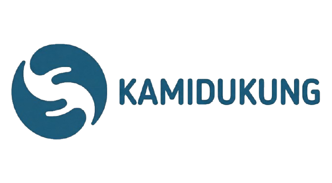

# 🚀 KAMIDUKUNG - Platform & Agensi Teknologi Modern

<div align="center">



**Mendukung digitalisasi bisnis tanpa batas. Dari UMKM hingga Enterprise, solusi teknologi modern untuk semua.**

[](https://nextjs.org/)
[](https://reactjs.org/)
[](https://www.typescriptlang.org/)
[](https://tailwindcss.com/)

</div>

---

## 📋 Daftar Isi

- [Tentang Proyek](#-tentang-proyek)
- [Fitur Utama](#-fitur-utama)
- [Tech Stack](#-tech-stack)
- [Instalasi](#-instalasi)
- [Penggunaan](#-penggunaan)
- [Struktur Proyek](#-struktur-proyek)
- [Deployment](#-deployment)
- [Kontribusi](#-kontribusi)
- [Lisensi](#-lisensi)
- [Kontak](#-kontak)

---

## 🎯 Tentang Proyek

**KAMIDUKUNG** adalah platform dan agensi teknologi modern yang menyediakan solusi digital komprehensif untuk bisnis dari berbagai skala - mulai dari UMKM hingga Enterprise. Website ini dibangun dengan teknologi terkini untuk memberikan pengalaman pengguna yang optimal dan performa yang maksimal.

### 🌟 Highlights

- ✨ **Modern UI/UX** - Desain premium dengan animasi smooth menggunakan Framer Motion
- 🌐 **Bilingual Support** - Mendukung Bahasa Indonesia dan English
- 📱 **Fully Responsive** - Optimized untuk semua ukuran layar
- ⚡ **Lightning Fast** - Built dengan Next.js 15 dan optimasi performa
- 🎨 **Beautiful Design** - Menggunakan Plus Jakarta Sans font dan Tailwind CSS v4
- 🔒 **SEO Optimized** - Meta tags dan struktur yang SEO-friendly

---

## ✨ Fitur Utama

### 🏠 Landing Page

- Hero section dengan CTA yang menarik
- Showcase layanan dan produk
- Statistik perusahaan yang dinamis
- Testimonial dari klien

### 💼 Layanan

- **Landing Page Development** - Rp 1.000.000 (hemat Rp 500.000)
- **Information System + Landing Page** - Rp 5.000.000
- **Custom Solutions** - Harga disesuaikan kebutuhan

### 👥 Tim & Partnership

- Profil tim profesional dengan LinkedIn integration
- Showcase 6+ partner terpercaya
- Auto-scrolling marquee untuk logo partner

### 📝 Blog

- Sistem blog dengan routing dinamis
- Artikel teknologi dan tutorial
- Responsive image handling

### 💬 Live Support

- Integrasi Tawk.to untuk live chat
- WhatsApp widget untuk komunikasi cepat
- Contact form yang responsif

---

## 🛠 Tech Stack

### Core Framework

- **[Next.js 15.2.6](https://nextjs.org/)** - React framework dengan App Router
- **[React 19.2.0](https://reactjs.org/)** - Library UI terbaru
- **[TypeScript 5.x](https://www.typescriptlang.org/)** - Type-safe JavaScript

### Styling & UI

- **[Tailwind CSS 4.1.9](https://tailwindcss.com/)** - Utility-first CSS framework
- **[Framer Motion 12.x](https://www.framer.com/motion/)** - Animation library
- **[Radix UI](https://www.radix-ui.com/)** - Headless UI components
- **[Lucide React](https://lucide.dev/)** - Beautiful icons

### Fonts

- **[Plus Jakarta Sans](https://fonts.google.com/specimen/Plus+Jakarta+Sans)** - Primary font (300-800 weights)

### Additional Tools

- **[React Hook Form](https://react-hook-form.com/)** - Form handling
- **[Zod](https://zod.dev/)** - Schema validation
- **[Vercel Analytics](https://vercel.com/analytics)** - Performance monitoring

---

## 📦 Instalasi

### Prerequisites

- Node.js 18.x atau lebih tinggi
- npm atau yarn atau pnpm

### Clone Repository

```bash
git clone https://github.com/Rbin01yuh/kamisupport.git
cd kamisupport
```

### Install Dependencies

```bash
npm install
# atau
yarn install
# atau
pnpm install
```

### Environment Variables

Buat file `.env.local` di root directory (opsional):

```env
# Analytics (opsional)
NEXT_PUBLIC_VERCEL_ANALYTICS_ID=your_analytics_id
```

---

## 🚀 Penggunaan

### Development Server

Jalankan development server:

```bash
npm run dev
# atau
yarn dev
# atau
pnpm dev
```

Buka [http://localhost:3000](http://localhost:3000) di browser Anda.

### Build untuk Production

```bash
npm run build
npm run start
```

### Linting

```bash
npm run lint
```

---

## 📁 Struktur Proyek

```
webkamisupport/
├── app/                      # Next.js App Router
│   ├── blog/                # Blog pages
│   ├── layout.tsx           # Root layout
│   ├── page.tsx             # Homepage
│   └── globals.css          # Global styles
├── components/              # React components
│   ├── ui/                  # UI components (Radix)
│   ├── about.tsx
│   ├── blog.tsx
│   ├── contact.tsx
│   ├── faq.tsx
│   ├── footer.tsx
│   ├── hero.tsx
│   ├── navbar.tsx
│   ├── partnership.tsx
│   ├── pricing.tsx
│   ├── services.tsx
│   ├── team.tsx
│   ├── testimonials.tsx
│   ├── whatsapp-widget.tsx
│   └── why-us.tsx
├── contexts/                # React contexts
│   └── language-context.tsx # i18n context
├── lib/                     # Utility functions
│   └── utils.ts
├── public/                  # Static assets
│   └── pictures/            # Images & logos
├── .vscode/                 # VS Code settings
├── next.config.ts           # Next.js config
├── tailwind.config.ts       # Tailwind config
├── tsconfig.json            # TypeScript config
└── package.json             # Dependencies
```

---

## 🌐 Deployment

### Vercel (Recommended)

[](https://vercel.com/new/clone?repository-url=https://github.com/Rbin01yuh/kamisupport)

1. Push code ke GitHub
2. Import project di [Vercel](https://vercel.com)
3. Deploy otomatis akan berjalan

### Manual Deployment

```bash
npm run build
# Upload folder .next, public, dan package.json ke hosting
```

---

## 🤝 Kontribusi

Kontribusi sangat diterima! Untuk kontribusi besar, silakan buka issue terlebih dahulu untuk mendiskusikan perubahan yang ingin Anda buat.

### Steps untuk Kontribusi

1. Fork repository
2. Buat branch fitur (`git checkout -b feature/AmazingFeature`)
3. Commit perubahan (`git commit -m 'Add some AmazingFeature'`)
4. Push ke branch (`git push origin feature/AmazingFeature`)
5. Buka Pull Request

---

## 📄 Lisensi

Distributed under the MIT License. See `LICENSE` for more information.

---

## 📞 Kontak

**KAMIDUKUNG**

- 🌐 Website: [kamidukung.com](https://kamidukung.com)
- 📧 Email: support@kamidukung.com
- 💬 WhatsApp: [+62 815-3616-4746](https://wa.me/6281536164746)
- 🔗 LinkedIn: [KAMIDUKUNG](https://linkedin.com/company/kamidukung)

### Tim Founder

- **Ridho Bintang Aulia** - Founder | Software & AI Engineer | IaaS Sales
  - LinkedIn: [ridhobintangaulia](https://www.linkedin.com/in/ridhobintangaulia/)
- **Alfarizi Dwi Prasetyo** - Founder | Software & AI Engineer
  - LinkedIn: [al-farizi-dwi-prasetyo](https://www.linkedin.com/in/al-farizi-dwi-prasetyo/)

---

## 🙏 Acknowledgments

- [Next.js Documentation](https://nextjs.org/docs)
- [Tailwind CSS](https://tailwindcss.com)
- [Framer Motion](https://www.framer.com/motion/)
- [Radix UI](https://www.radix-ui.com/)
- [Vercel](https://vercel.com)

---

<div align="center">

**Made with ❤️ by KAMIDUKUNG Team**

⭐ Star this repo if you find it helpful!

</div>
